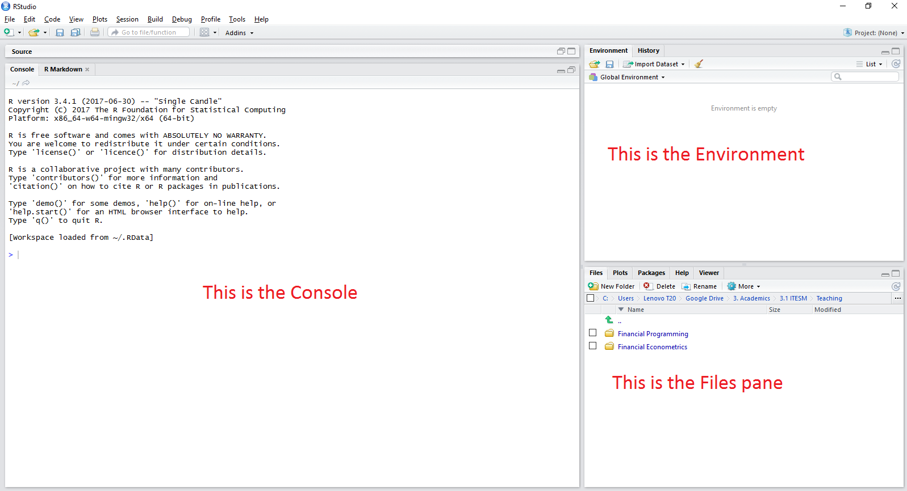

# Part V - Annex {#Annex}

Work in progress

## Setting up R and RStudio {#SetupR}

### Setting up R

Follow the steps below to complete the installation of *R*.

1) Go to the website of **The Comprehensive R Archive Network** at <https://cran.r-project.org/> where the latest version of *R* is available. At the moment of writing this document the latest version is *R-3.4.1* for Windows and Mac.

2) Find the link and download to the appropriate binary setup file for your operating system (Windows or Mac). Current binary versions of *R* run on Windows 7 or later, including on 64-bit versions. Windows XP is no longer supported.

3) Open the downloaded `.exe` file and Install *R*. I suggest to accept the standard installation.

### Setting up RStudio

*RStudio* is **not** a programming language, but an integrated development environment (IDE) for *R*. In other words, *RStudio* is the place where you will create your computer programs using the *R* language so the computer can read and execute your instructions.

Before installing *RStudio* it is important to make sure that you have completed the installation of *R* in your computer, otherwise you could not use *RStudio* functionally. Here are some simple steps to follow to complete the installation of *RStudio*:

1) Go to the webpage <https://www.rstudio.com/products/RStudio/> where you will find the latest version of the software. At the moment of writing this document the latest version is *RStudio 1.0.153*.

2) Scroll down to the butom of the page and find the list of *Installers for Supported Platforms*. 

3) Find the appropriate installer file for your operating system (Windows or Mac) and download it.

4) Once the download has been completed run the `.exe` file. Proceed with the standard installation.

It is advised to reboot your computer once the installation has been completed.

### Working in RStudio

Once you have completed the installations, you can open *RStudio* as any other application in your computer. The predefined view includes some internal windows called *panes*. There are three panes setted up by default:

1. The Console.
2. The Enviroment and History.
3. The Files, Plots, Packages and Help pane.

There is a fourth pane that we will introduce later, the *R script and data view* window.

